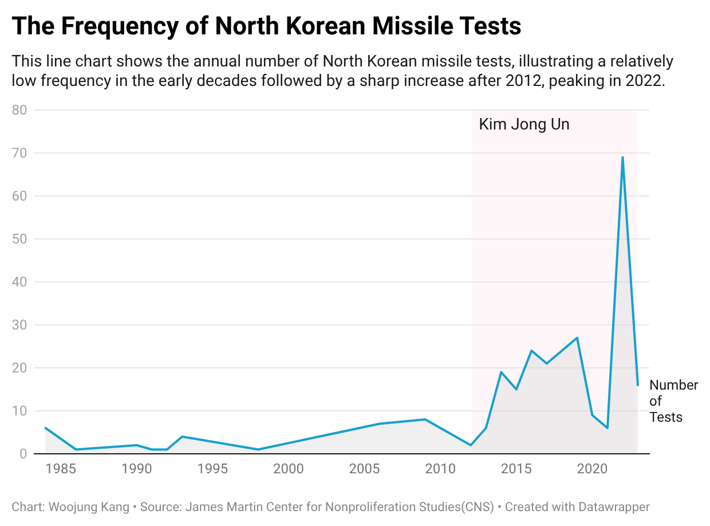
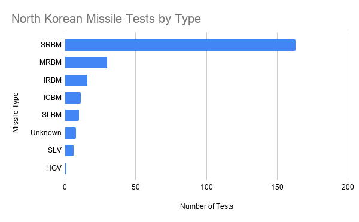
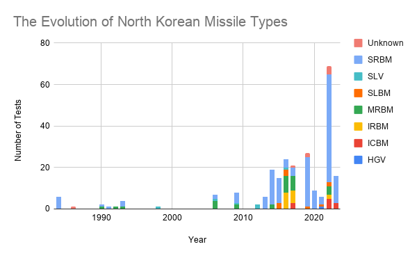

# North Korea's Missile Testing Has Become More Frequent and More Diverse

For decades, North Korea has developed its military capabilities and demonstrated its power through missile tests. However, the scale and composition of these tests have changed significantly over time. While the annual number of tests was relatively limited throughout the 1980s, 1990s, and early 2000s, the pace has increased dramatically since Kim Jong Un took power in 2012.

Using the North Korean Missile Test Database compiled by the James Martin Center for Nonproliferation Studies (CNS), this project examines how North Korea's testing activities evolved from 1984 to 2023. Rather than focusing on individual launches, this analysis explores three key questions:
How often were missiles tested?
Which missile types were tested most frequently?
How has the mix of missile types changed over time?

## 1. How often were missiles tested?

Historically, North Korea's missile testing was sporadic. Between 1984 and 2011, under the leadership of Kim Il Sung and Kim Jong Il, the regime conducted tests infrequently, often pausing for international negotiations or moratoriums. However, the data reveals a clear shift in strategy starting in 2012, coinciding with Kim Jong Un assuming power.

Since 2012, the frequency of tests has increased significantly. According to the dataset, this upward trend reached an unprecedented peak in 2022. During this single year, North Korea conducted more missile tests than in any previous period, demonstrating a stark departure from its historical testing pace and a rapid acceleration in its weapons development program.

## 2. Which missile types were tested most frequently?

When examining the entire history of North Korea's missile program, one specific type of weapon clearly dominates the dataset. 

*Description: This bar chart breaks down the total number of North Korean missile tests by type, revealing that Short-Range Ballistic Missiles (SRBMs) make up the vast majority of historical launches.*
*Source: James Martin Center for Nonproliferation Studies (CNS)*

According to the data, Short-Range Ballistic Missiles (SRBMs), such as the Scud and KN-series models, account for the vast majority of all recorded tests. While they are limited in range compared to intercontinental weapons, SRBMs pose a direct, existential threat to the Korean peninsula and nearby neighbors. The sheer volume of SRBM tests highlights Pyongyang's continuous focus on developing and refining tactical weapons for regional intimidation. 

However, looking only at these cumulative totals obscures a much more dangerous technological evolution happening beneath the surface.

## 3. How has the mix of missile types changed over time?

While Short-Range Ballistic Missiles (SRBMs) account for the largest share of total launches, examining the composition of missiles tested year by year reveals the technological evolution of North Korea's weapons program. During its early decades, Pyongyang’s testing was almost exclusively focused on short-range weapons.

*Description: This stacked column chart displays the evolution of North Korean missile types tested over time, showing a shift from early short-range missiles to advanced intercontinental ballistic missiles (ICBMs).*
*Source: James Martin Center for Nonproliferation Studies (CNS)*

However, as the stacked column chart demonstrates, the diversity of the arsenal has expanded significantly over the last decade. Recent years have seen the alarming introduction and increasing frequency of Medium-Range Ballistic Missiles (MRBMs), Submarine-Launched Ballistic Missiles (SLBMs), and, ultimately, Intercontinental Ballistic Missiles (ICBMs) capable of reaching the United States mainland. 

This changing composition in the dataset proves that North Korea's military strategy has transitioned from maintaining a localized, regional threat to aggressively building a multi-layered, advanced nuclear deterrent with global reach.

## Methodology & Data Limitations

This analysis relies on the [North Korean Missile Test Database](https://www.kaggle.com/datasets/mexwell/north-korea-missile-test-database?select=Missile+Tests-Tabelle+1.csv), maintained by the James Martin Center for Nonproliferation Studies (CNS). While CNS is a highly reputable academic research institution, analyzing data from one of the world's most isolated states presents inherent challenges. The database relies heavily on unclassified intelligence, news reports, and official statements from the U.S., South Korea, and Japan. Consequently, there can be conflicting assessments regarding a specific missile's type or its ultimate test outcome. 

Additionally, the original dataset's date formats were inconsistent. To accurately analyze the timeline and generate the charts, the dates were manually cleaned and standardized into a new 'Year' column using spreadsheet formulas.

Furthermore, as the database itself notes, records from the program's early years (prior to 1993) are largely based on best estimates and are less complete than recent observations. Therefore, it is important to understand that this dataset represents *detected* or *known* tests; there may be undisclosed failures or uncounted launches that remain hidden due to the extreme secrecy of the North Korean regime.

## Summary & Ethical Concerns

In conclusion, the data demonstrates a clear shift in North Korea's missile testing strategy since 1984. What began as infrequent testing of short-range missiles has evolved into a highly active program featuring a diverse mix of advanced weapon systems, including ICBMs. 

However, from a journalistic and ethical standpoint, it is crucial to present these trends carefully. Journalists must avoid generating undue panic or unintentionally stigmatizing the North Korean citizenry, who have no control over the regime's military decisions. Presenting raw testing numbers without proper geopolitical context can inadvertently misrepresent the broader situation. 

To make this a fully comprehensive and ethical data story, further on-the-ground reporting is required. A reporter would need to interview diplomatic and security experts to explore how these spikes in testing correlate with international sanctions or joint U.S.-South Korea military exercises. Providing this broader context is essential to giving readers a complete and nuanced picture of the region's dynamics.

